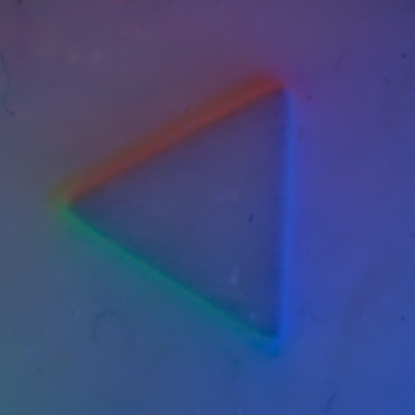
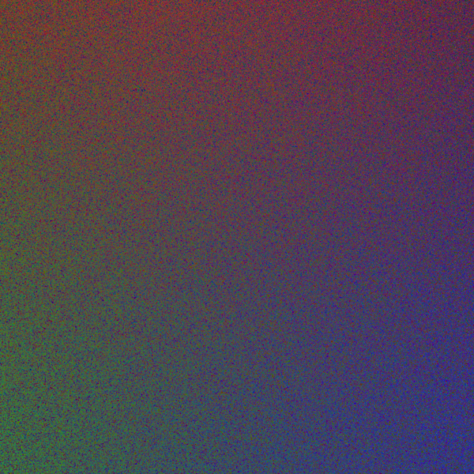
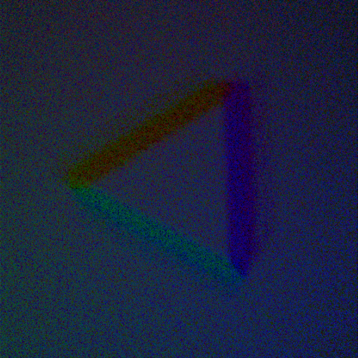

Tactile optical simulation
============================
# Requirements 
- Python>=3.7

# Setup
The project uses [Mitsuba2 renderer](https://mitsuba2.readthedocs.io/en/latest/)(v2.1.0) for generating all the images. For quick start, python package for renderer is available [here](https://github.com/CMURoboTouch/mitsuba2-python-package).
You can also use docker images which are available [here](https://github.com/arpit15/mitsuba2-docker)

- For installing python dependencies
```bash
pip3 install -r requirements.txt
```
 
# Quick Start
- `python3 generate_image.py`
- To choose the configuration file see files inside `file_list_cfgs`
- To choose the render configurations see files inside `render_cfgs`

# Expected Results
|  |  |
|:---:|:---:|
|Real Sensor Image|Rendered Image|

# Usage
User can render a new object by providing its mesh in Wavefront .obj format and passing its name as a param to render function. `new_mesh_render.py` provides an example. Please refer to the script for more details.
- Execute `python new_mesh_render.py` to render a sensor view without any object pressed against it.

# Output Visualization
- [tev](https://github.com/Tom94/tev) is a EXR viewer and comparison tool. You can download the latest executables from [here](https://github.com/Tom94/tev/releases/tag/v1.16)
- [qt4Image](https://github.com/edgarv/hdritools) is another viewer for exr images across different platform. It can also generate low-dynamic range images with gamma encoding. You can download the utility for linux from [this](https://github.com/edgarv/hdritools/releases/download/0.5.0/qt4Image-Qt5_0.5.0-20170712-win64-amd64-vc141.zip) link.

# Advanced
- Building from source gives ability to run faster simulation by using GPU and setup optimization for different simulation models. The instructions to build from source are mentioned in [official documentation](https://mitsuba2.readthedocs.io/en/latest/) 
- The model files for GelSight are in Mitsuba xml format. The [Mitsuba2 documentation](https://mitsuba2.readthedocs.io/en/latest/src/plugin_reference/intro.html) has details on the parameters and how to set them. 
- The important file which are used in rendering for flatgel is or `models/flatgel_with_mesh.xml` 

# Not supported
- Bidirectional Path tracing
- Heightfields

# Known issues
- Currently mitsuba2 outputs artifacts in rendered image on macOS  

|  |  |
|:---:|:---:|
|Linux|MacOS|

# Citation
```bibtex
@article{agarwal2020simulation,
  title={Simulation of Vision-based Tactile Sensors using Physics based Rendering},
  author={Agarwal, Arpit and Man, Tim and Yuan, Wenzhen},
  journal={arXiv preprint arXiv:2012.13184},
  year={2020}
}
```